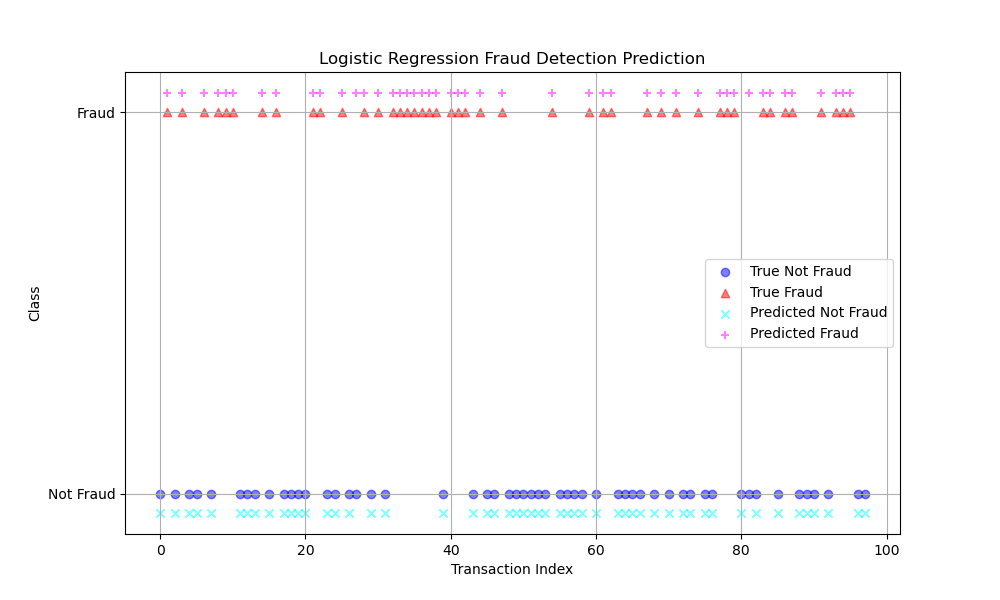

# Introduction

Full project on detecting credit card fraud using Python. I developed different classification models to predict whether a transaction is fraudaulent or not and evaluated them by various score metrics, including. precision, recall, and F1-score.

I used the following models throughout for detecting credit card fraud:
- **Logistic Regression:** A baseline statistical model for estimating probabilities, widely used for binary classification.
- **Shallow Neural Network:** A simpler architecture testing the hypothesis that less complexity can effectively capture data patterns.
- **Random Forest:** Constructs multiple decision trees for classification, known for high accuracy and flexibility.
- **Gradient Boosting Machine:** Uses sequential model building to correct errors, known for its predictive power.
- **Support Vector Machine:** Known for its effectiveness in high-dimensional spaces, ideal for binary classification tasks.

Check the detailled machine learning algorithms out here: [CreditCard_Fraud_Detection](/)

This machine learning project is inspired by [Greg Hogg](https://www.youtube.com/watch?v=M_Cu7r9gik4&list=PLBYyBfw8A2fLqrrYW5PUWSm8NqVvzYzyc&index=11).

### Problem Setting:
It is important that credit card companies are able to recognize fraudulent credit card transactions so that customers are not charged for items that they did not purchase.

### Goal:
The goal of this project is to predict credit card fraud based on various features, such as time and amount.

### Background:
This dataset presents transactions that occurred in two days, where we have 492 frauds out of 284,807 transactions. The dataset is highly unbalanced, the positive class (frauds) account for 0.172% of all transactions.

It contains only numerical input variables which are the result of a PCA transformation. Due to confidentiality issues, the original features and more background information about the data cannot be disclosed.

Features V1, V2, … V28 are the principal components obtained with PCA, the only features which have not been transformed with PCA are 'Time' and 'Amount'. Feature 'Time' contains the seconds elapsed between each transaction and the first transaction in the dataset. The feature 'Amount' is the transaction Amount, this feature can be used for example-dependant cost-sensitive learning.

Feature 'Class' is the response variable and it takes value 1 in case of fraud and 0 otherwise.

### Tools I Used:
For my deep dive into the development of a classification machine learning model of the data, I harnessed the power of several key tools:

- **Python** 
- **Jupyter Notebook**
- **Sklearn**
- **Tensorflow**
- **Neural Networks**
- **Robust Scaling**
- **Classification Metrics**

# Data Pre-Processing and EDA
To clean and manipulate the credit card data, I used the [CreditCard_Fraud_Data](/creditcard.csv) file, running some preliminary explorative data analysis (EDA) and applying robust scaling using sklearn's ```RobustScaler```.

Here's the breakdown of the Credit Card Fraud Pre-Processing and EDA:
- 492 transactions have been labeled as Class 1, i.e., fraudaulent transactions. The total number of transactions is 284807.
- Transactions amount have wide spreads with min. of 0 and max. 25691.16
- Relative fraudaulent cases = 0.1727%.
- Robust scaling on amount and time feature.

# Train / Test Split 
To split the data, I used the ```train_test_split``` from from *sklearn.model_selection library*. The data is split into training, validation, and a test set.

```python
train_lib, pre_test_lib = train_test_split(new_df, test_size = 0.2, random_state=50)
test_lib, val_lib = train_test_split(pre_test_lib, test_size = 0.5, random_state=50)
x_train, y_train = train_lib.iloc[:, :-1], train_lib.iloc[:, -1]
x_test, y_test = test_lib.iloc[:, :-1], test_lib.iloc[:, -1]
x_val, y_val = val_lib.iloc[:, :-1], val_lib.iloc[:, -1]
```

# Model Training & Evaluation

**Logistic Regression Model**

```python
logreg = LogisticRegression()
logreg.fit(x_train, y_train)
```

**Shallow Neural Network**

```python
from tensorflow.keras.models import Sequential
from tensorflow.keras.layers import InputLayer, Dense, BatchNormalization
from tensorflow.keras.callbacks import ModelCheckpoint

shallow_nn =  Sequential()
shallow_nn.add(InputLayer((x_train.shape[1],)))
shallow_nn.add(Dense(2, "relu"))
shallow_nn.add(BatchNormalization())
shallow_nn.add(Dense(1, "sigmoid")) # output probabilitly
checkpoint = ModelCheckpoint("shallow_nn", save_best_only=True)
shallow_nn.compile(optimizer="adam", loss = "binary_crossentropy", metrics=["accuracy"])
shallow_nn.fit(x_train, y_train, validation_data=(x_val, y_val), epochs=5, callbacks=checkpoint, batch_size=32)
```
I also developed a function to predict and report classification metrics for neural networks trained and fitted throughout this project.

```python
def neural_net_predictions(model, x, y):
    nn_pred = (model.predict(x).flatten() > 0.5).astype(int)
    clas_rep = classification_report(y, nn_pred, target_names=["Not Fraud", "Fraud"])
    print(clas_rep)
    
neural_net_predictions(shallow_nn, x_val, y_val)
```

**Random Forest Classifier**

```python
rf = RandomForestClassifier(max_depth=2, n_jobs=-1)
rf.fit(x_train, y_train)
```

**Random Forest Classifier**

```python
rf = RandomForestClassifier(max_depth=2, n_jobs=-1)
rf.fit(x_train, y_train)
```

**Random Forest Classifier**

```python
gbc = GradientBoostingClassifier(n_estimators=50, learning_rate=1.0, max_depth=1, random_state=0)
gbc.fit(x_train, y_train)
```

**Support Vector Machine**

```python
svc = LinearSVC(class_weight="balanced")
svc.fit(x_train, y_train)
```

### Model Classification Overview

| Model          | Class     | Precision | Recall | F1-Score | Accuracy | Support |
|----------------|-----------|-----------|--------|----------|----------|---------|
| Support Vector | Fraud     | 0.66      | 0.72   | 0.69     | 1.00     | 43      |
|                | Not Fraud | 1.00      | 1.00   | 1.00     | 1.00     | 28438   |
| Gradient Boost | Fraud     | 0.66      | 0.63   | 0.64     | 1.00     | 43      |
|                | Not Fraud | 1.00      | 1.00   | 1.00     | 1.00     | 28438   |
| Shallow NN     | Fraud     | 0.61      | 0.65   | 0.63     | 1.00     | 43      |
|                | Not Fraud | 1.00      | 1.00   | 1.00     | 1.00     | 28438   |
| Logistic Reg.  | Fraud     | 0.79      | 0.51   | 0.62     | 1.00     | 43      |
|                | Not Fraud | 1.00      | 1.00   | 1.00     | 1.00     | 28438   |
| Random Forest  | Fraud     | 0.74      | 0.47   | 0.57     | 1.00     | 43      |
|                | Not Fraud | 1.00      | 1.00   | 1.00     | 1.00     | 28438   |


# Undersampling Method

The data set is highly imbalanced with fraudulent transactions being significantly rarer than legitimate ones (284315 vs. 492 transactions). This imbalance can lead to biased models that favor the majority class and overlook the minority class (fraudulent transactions).

```python
balanced_df = pd.concat([frauds, not_frauds.sample(len(frauds), random_state=1)])
balanced_df["Class"].value_counts()
```
By implementing undersampling, we reduce the size of the majority class, balancing the dataset and enhancing the model's ability to detect fraud more accurately and efficiently (492 vs. 492 transactions for fraudaulent and non-fraudaulent transactions).

I rerun a train and test split according to the configuration above. In addition, I re-trained new models using the machine learning algorithms like above, including an additional shallow neural network.

### Model Classification Overview (Undersampled Data)

| Balanced Model                         | Class     | Precision | Recall | F1-Score | Accuracy | Support |
|-------------------------------|-----------|-----------|--------|----------|----------|---------|
| Logistic Regression (LogReg)  | Not Fraud | 0.95      | 0.96   | 0.95     | 0.95     | 54      |
|                               | Fraud     | 0.95      | 0.93   | 0.94     | 0.95     | 45      |
| Shallow Neural Network (1)    | Not Fraud | 0.83      | 1.00   | 0.91     | 0.89     | 54      |
|                               | Fraud     | 1.00      | 0.76   | 0.86     | 0.89     | 45      |
| Shallow Neural Network (2)    | Not Fraud | 0.84      | 0.96   | 0.90     | 0.88     | 54      |
|                               | Fraud     | 0.95      | 0.78   | 0.85     | 0.88     | 45      |
| Random Forest Classifier      | Not Fraud | 0.85      | 0.98   | 0.91     | 0.90     | 54      |
|                               | Fraud     | 0.97      | 0.80   | 0.88     | 0.90     | 45      |
| Gradient Boosting Classifier  | Not Fraud | 0.88      | 0.93   | 0.90     | 0.89     | 54      |
|                               | Fraud     | 0.90      | 0.84   | 0.87     | 0.89     | 45      |
| Support Vector Machine (SVM)  | Not Fraud | 0.93      | 0.96   | 0.95     | 0.94     | 54      |
|                               | Fraud     | 0.95      | 0.91   | 0.93     | 0.94     | 45      |


# Testing Best Model on Holdout Set

In our quest to find the optimal model for credit card fraud detection, we focus on the F1-score for "Fraud" due to its holistic view combining precision and recall. Through our analysis:

- **Balanced dataset** is prioritized for evaluation due to its fair class representation.
- Among all models, **Logistic Regression (LogReg)** stands out with the highest F1-score of **0.94** for detecting fraud.

```python
# predict on unseen holdout data (y_test_bal, x_test_bal)
print(classification_report(y_test_bal, logreg_bal.predict(x_test_bal), target_names=["Not Fraud", "Fraud"]))
```
### Plot Credit Card Detection Model Effectiveness



*Classification plot evaluating the Logistic Regression model on the holdout set*


### Results & Interpretation

- Analyzed a dataset of 284,807 transactions, identifying 492 (0.1727%) as fraudulent through robust scaling and analysis.
- Applied robust scaling on 'amount' and 'time' features to normalize the data, enhancing model accuracy.
- Utilized a Logistic Regression model, achieving an overall accuracy of 0.98 in classifying transactions as fraudulent or legitimate.
- Achieved perfect precision (1.00) for legitimate transactions and high precision (0.96) for fraudulent transactions, minimizing false positives.
- The model demonstrated exceptional performance with F1-Scores of 0.98 for both classes, indicating a balanced and effective approach to fraud detection.


# What I Learned

### Key Learnings and Achievements:
1. **Diverse Model Application**
   - Utilized a variety of models (Logistic Regression, Shallow Neural Networks, Random Forest, Gradient Boosting Machine, Support Vector Machine) to understand their unique strengths and limitations in detecting credit card fraud in an imbalanced dataset.
2. **Importance of Data Pre-processing**
   - Highlighted the critical role of data normalization through robust scaling on 'amount' and 'time' features, significantly improving the models' accuracy by preparing the data effectively for the analysis.
3. **Challenges of Imbalanced Data**
   - Addressed the challenges of working with highly imbalanced data, employing undersampling to balance the dataset, which enhanced the models' ability to accurately and efficiently detect fraudulent transactions.
4. **Evaluation Metric Selection**
   - Emphasized the importance of using precision, recall, and F1-score as primary metrics for evaluating the models' performance in imbalanced classification tasks, offering a nuanced view of their effectiveness beyond simple accuracy.
5. **Model Optimization and Selection**
   - The iterative process of training, evaluation, and comparison led to the selection of Logistic Regression based on its high F1-score for detecting fraud, showcasing the importance of model optimization in achieving superior performance.

These learnings underscore the complexity of fraud detection and the nuanced approach required in model selection and data handling to develop an effective fraud detection system.

# Conclusion

### Insights

This project shed light on the intricate dynamics of detecting credit card fraud using **machine learning** models. Through rigorous experimentation with Logistic Regression, Shallow Neural Networks, Random Forest, Gradient Boosting Machine, and Support Vector Machine, the project highlighted the critical importance of data pre-processing, the challenge of managing imbalanced datasets, and the strategic significance of choosing the right model. Each model brought unique insights into the fraud detection process, underscoring the need for a nuanced approach in model selection. The deployment of different models demonstrated how tailored data science solutions could significantly enhance the detection of fraudulent activities, making evident the necessity of precision, recall, and F1-score as holistic measures of model performance.

### Closing Thoughts

The journey through this project not only honed my technical prowess in leveraging machine learning for fraud detection but also deepened my understanding of the ethical and practical dimensions inherent in the deployment of such technologies in the financial domain. It highlighted the critical role of data scientists in developing robust, ethical, and effective solutions that can protect consumers and financial institutions alike from the perils of fraud. This project served as a testament to the power of machine learning in navigating the complexities of modern financial ecosystems, emphasizing the need for continuous innovation, ethical considerations, and a deep understanding of the domain to craft solutions that address real-world challenges effectively.
